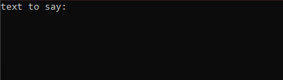
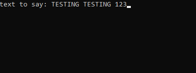
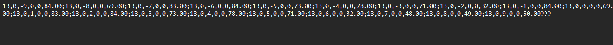
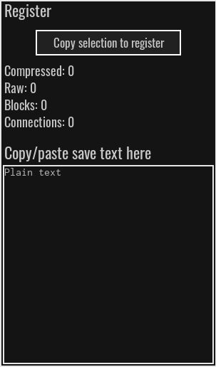
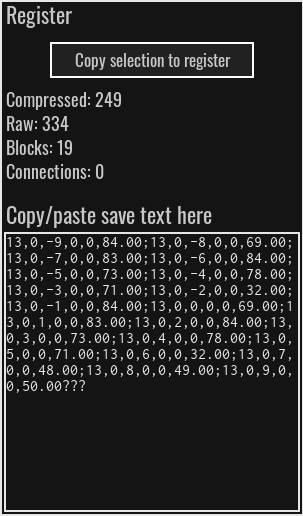
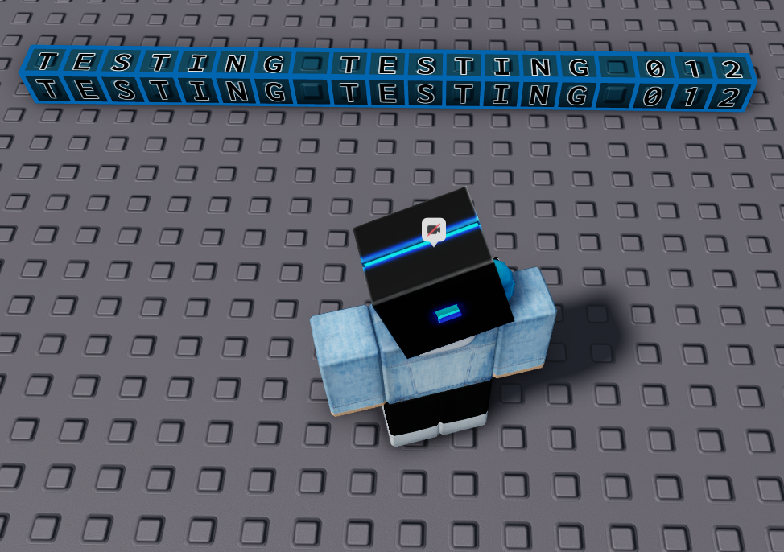

# text-gen-cm2
Generate save codes for text with text blocks in Circuit Maker 2

**DISCLAIMER:** This tool isn't a virus. 13 antiviruses detect it as Trojan.Cerbu because it creates a file called "output.txt", which can be one of the steps of Trojan.Cerbu. We will eventually fix this, don't worry.

1) open cm2

2) open "genText.exe"

3) type anything you want in the "text to say" prompt (must be uppercase)

4) open "output.txt". you should see some text like this.

5) click the stack of papers in cm2 (the register)

(then you should see a menu like this)

6) paste in the text from "output.txt" (make sure you press enter)

7) click the stamper tool

8) stamp down the build

9) rotate the text to the right direction if you need to (no image)

10) ok so basically, you're done.
